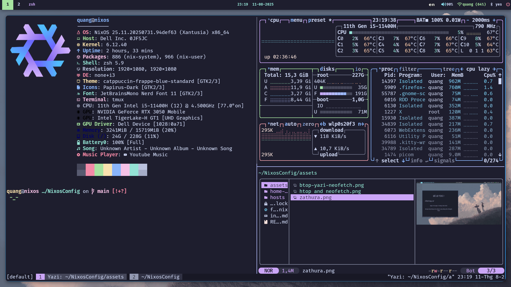

<h1 align="center"> My dotfiles Nixos</h1>

<div align="center">


</div>

## SHOWCASE
 
 
## INSTALL
Before install enter the **tty** (`Ctrl+Shift+F2`) to begin.
> [!NOTE]
> * Nixos version 25.05
> * Before install add features `flake` and `nix-command` in your `/etc/nixos/configuration.nix`
>   ```
>   nix.settings.experimental-features = ["flake" "nix-command"];
>   ```
* ***Clone my repo***
    ```
    nix-shell -p git
    cd ~
    git clone https://github.com/ledangquangdangquang/NixosConfig.git
    cd NixosConfig
    ```
* ***Replace `hardware-configuration.nix`***
    ```
    cp /etc/nixos/hardware-configuration.nix ~/NixosConfig/hosts/nixos/hardware-configuration.nix
    ```
    If your host is **virtual machine**
    ```
    cp /etc/nixos/hardware-configuration.nix ~/NixosConfig/hosts/nixos-vm/hardware-configuration.nix
    ```
* ***Install flake***
    ```
    sudo nixos-rebuild switch --flake ./#nixos 
    ```
    If your host is **virtual machine**
    ```
    sudo nixos-rebuild switch --flake ./#nixos-vm
    ```
* ***Install home-manager***
    ```
    home-manager switch --flake ./#quang@nixos
    ```
    If your host is **virtual machine**
    ```
    home-manager switch --flake ./#quang@nixos-vm
    ```

## KEYSHORTCUTS
<table><thead><tr><th colspan="2">I3 (Mod = Super)</th><th colspan="2">Tmux</th></tr></thead><tbody><tr><td>Key</td><td>Description</td><td>Key</td><td>Description</td></tr><tr><td>`Mod+Enter`</td><td>Launch terminal (Alacritty)</td><td>`Alt+r`</td><td>Reload tmux configuration file</td></tr><tr><td>`Mod+f`</td><td>Launch Firefox</td><td>`Alt+1` → `Alt+9`</td><td>Quickly switch to window 1 → 9</td></tr><tr><td>`Mod+q`</td><td>Close focused window</td><td>`Alt+h` / `Alt+l` / `Alt+k` / `Alt+j`</td><td>Move focus to pane left / right / up / down</td></tr><tr><td>`Mod+d`</td><td>Launch application menu (Rofi)</td><td>`Alt+←` / `Alt+→` / `Alt+↑` / `Alt+↓`</td><td>Resize pane (left/right ±5, up/down ±3)</td></tr><tr><td>`F8`</td><td>Take a screenshot and save to `~/Pictures/Screenshots/screenshot.png`</td><td>`Alt+s`</td><td>Split pane horizontally</td></tr><tr><td>`F10` / `F9`</td><td>Increase / decrease volume (+/-10%)</td><td>`Alt+v`</td><td>Split pane vertically</td></tr>
<tr><td>`F12` / `F11`</td><td>Unmute / mute audio</td><td>`Alt+o`</td><td>Open Neovim with Telescope file search</td></tr><tr><td>`Mod+h` / `Mod+j` / `Mod+k` / `Mod+l`</td><td>Move focus left / down / up / right</td><td>`Alt+Shift+O`</td><td>Open Neovim with fuzzyvim file search (fzf preview)</td></tr><tr><td>`Mod+←` / `Mod+↓` / `Mod+↑` / `Mod+→`</td><td>Move focus using arrow keys</td><td>`Alt+n`</td><td>Create a new window</td></tr><tr><td>`Mod+Shift+h/j/k/l`</td><td>Move focused window left / down / up / right</td><td></td><td></td></tr><tr><td>`Mod+b` / `Mod+v`</td><td>Split container horizontally / vertically</td><td></td><td></td></tr><tr><td>`Mod+Shift+f`</td><td>Toggle fullscreen</td><td></td><td></td></tr><tr><td>`Mod+s` / `Mod+w` / `Mod+e`</td><td>Switch layout: stacking / tabbed / toggle split</td><td></td><td></td></tr><tr><td>`Mod+Shift+space`</td><td>Toggle floating mode for focused window</td><td></td><td></td></tr>
<tr><td>`Mod+space`</td><td>Toggle focus mode (tiling / floating)</td><td></td><td></td></tr><tr><td>`Mod+a`</td><td>Focus parent container</td><td></td><td></td></tr><tr><td>`Mod+1` → `Mod+0`</td><td>Switch to workspace 1 → 10</td><td></td><td></td></tr><tr><td>`Mod+Shift+1` → `Mod+Shift+0`</td><td>Move container to workspace 1 → 10</td><td></td><td></td></tr><tr><td>`Mod+Shift+c`</td><td>Reload i3 configuration</td><td></td><td></td></tr><tr><td>`Mod+Shift+r`</td><td>Restart i3</td><td></td><td></td></tr><tr><td>`Mod+Shift+e`</td><td>Exit i3 session</td><td></td><td></td></tr><tr><td>`Mod+r`</td><td>Enter resize mode</td><td></td><td></td></tr><tr><td>In resize mode: `h/j/k/l` or `←/↓/↑/→`</td><td>Resize window</td><td></td><td></td></tr><tr><td>`Return` / `Escape` / `Mod+r`</td><td>Exit resize mode</td><td></td><td></td></tr></tbody></table>

> [!NOTE]
> * See all keyshortcuts in `~/NixosConfig/home-manager/modules/i3/config` 
> * See all keyshortcuts **tmux** in `~/NixosConfig/home-manager/modules/tmux.nix`
